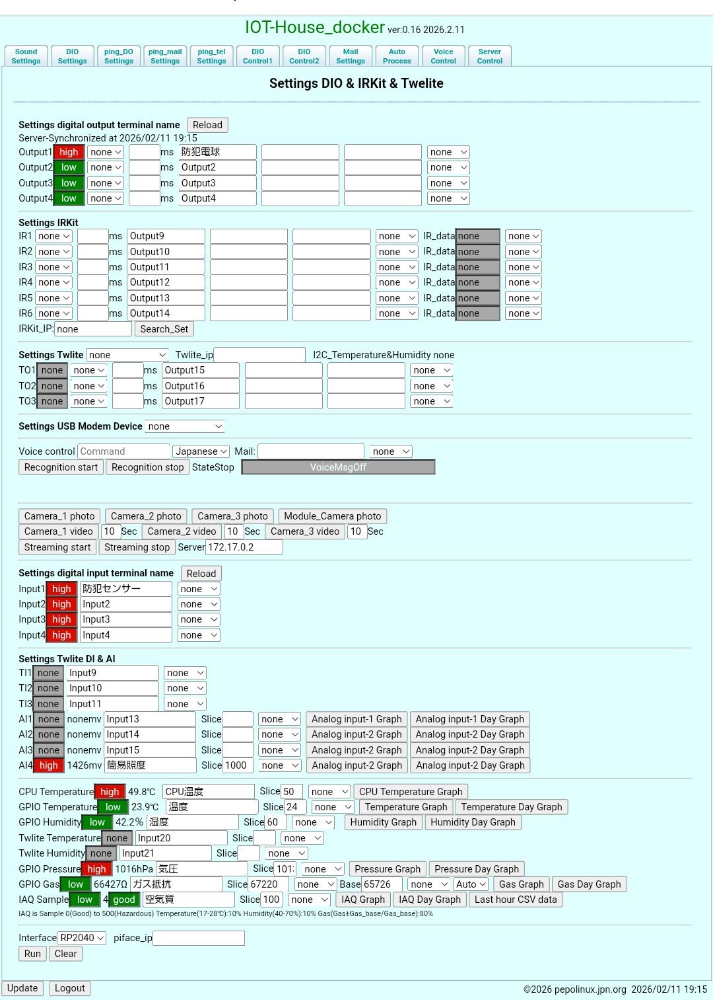

# IOT-House_docker
- [IOT-House_docker](https://github.com/kujiranodanna/IOT-House_docker) is a reconstruction of [IOT-House_old_pc](https://github.com/kujiranodanna/IOT-House_old_pc) based on amd64/ubuntu:24.04 amd64/ubuntu:22.04 or i386/ubuntu18.04. Ver:0.16 2026.2.10

- From Ver:0.16, you can now switch between CP2112 and RP2040-Zero.
  - Please refer to the URL below for the Python program code of [RP2040-Zero](https://amzn.to/3Ox7vjL).
  - [note kujiranodanna](https://note.com/kujiranodanna/n/n02874aeaa68d)
  - After installing it on the USB, run the following command.
  - If you want to use the RP2040-Zero from a Windows Docker container, you will need to bind and attach to the RP2040-Zero using powershell and wsl2, as described below.
  - Execute as follows.<br>
  docker run -itd --privileged --name iot-house_docker -p 8022:22 -p 80:80 -p 443:443 kujiranodanna/iot-house_docker:latest
- Requires docker privilege mode to use gpio's CP2112(Silicon Laboratories Single-Chip HID USB to SMBus Master Bridg)[Sunhayato MM-CP2112](https://amzn.to/3MhbeOd).
- Wireless GPIO[mono wireless TWELITE and MONOSTICK](https://amzn.to/3YYzDj4)
- Execute as follows.<br>
  docker run -itd --privileged --name iot-house_docker --device=/dev/ttyUSB0:/dev/ttyUSBTWE-Lite -p 8022:22 -p 80:80 -p 443:443 kujiranodanna/iot-house_docker:latest
- The Docker engine can only run on Linux. Windows and Mac won't work.
- It also works on Windows Docker Desktop, but it takes some time, but it's still a great challenge to be able to operate USB-connected devices directly from a container.
  --> As of August 10, 2024, operation has been confirmed on Windows 11.

  - Install the latest PowerShell 7.4.4 or later and usbipd-win_x.msi.

  - Then you need to bind and attach the USB device.
```
Run wsl2 first
into PowerShell
PowerShell 7.4.4
usbipd list    
Connected:
BUSID  VID:PID    DEVICE                                                        STATE
.
2-1    10c4:ea90  USB input devices <-- cp2112                                  Not shared
2-2    0403:6001  USB Serial Converter <-- TWELITE                              Not shared
.
usbipd bind --busid 2-1
usbipd bind --busid 2-2
usbipd attach --wsl --busid 2-1
usbipd attach --wsl --busid 2-2
.
usbipd list    
connected:
BUSID  VID:PID    DEVICE                                                        STATE
.
2-1    10c4:ea90  USB input devices                                           Attached
2-2    0403:6001  USB Serial Converter                                        Attached
.
docker run -itd --privileged --name iot-house_docker --device=/dev/ttyUSB0:/dev/ttyUSBTWE-Lite -p 8022:22 -p 80:80 -p 443:443 kujiranodanna/iot-house_docker:latest
If you don't have TWELITE, follow the steps below
docker run -itd --privileged --name iot-house_docker -p 8022:22 -p 80:80 -p 443:443 kujiranodanna/iot-house_docker:ubuntu22.04-latest
```
- By the way, in the case of Windows, it can be started without a devices.
This allows you to remotely control the Raspberry Pis at IOT House, and is also useful when using voice commands and responses.Execute as follows.<br>
  docker run -itd --privileged --name iot-house_docker -p 8022:22 -p 80:80 -p 443:443 kujiranodanna/iot-house_docker:latest
- Before building the image, copy the contents of amd64_bin/* or i386_bin/* to the app-src/bin/ directory according to your environment.
- Related articles Related articles<br>
How about using Docker Desktop for Windows for your summer vacation research project?<br>
  https://www.youtube.com/shorts/8S-WZ3UvIUA<br>
  https://iot-house.jpn.org/wp/2024/08/10/%e5%a4%8f%e4%bc%91%e3%81%bf%e3%81%ae%e8%87%aa%e7%94%b1%e7%a0%94%e7%a9%b6%e3%81%abdocker%e3%81%af%e3%81%84%e3%81%8b%e3%81%8c%e3%80%80%e3%81%9d%e3%81%ae%ef%bc%91/
- https://hub.docker.com/r/kujiranodanna/iot-house_docker<br><br>
- If you want to use RP2040-Zero from a Windows Docker container, you need to do the following:
```
# Run wsl2 first
# into PowerShell
PS C:\Users\user1> usbipd list
Connected:
BUSID  VID:PID    DEVICE                                                        STATE
1-1    2e8a:0005  USB シリアル デバイス (COM12) <-- RP2040-Zero                 Not shared
.
Persisted:
GUID                                  DEVICE
16044ecb-14c4-447f-a710-32f169f15668  USB Serial Converter
.
usbipd: warning: USB filter 'USBPcap' is known to be incompatible with this software; 'bind --force' will be required.
PS C:\Users\user1> usbipd bind --force --busid 1-1
PS C:\Users\user1> usbipd list
Connected:
BUSID  VID:PID    DEVICE                                                        STATE
1-1    2e8a:0005  USB シリアル デバイス (COM12)                                 Shared (forced)
.
PS C:\Users\user1> usbipd attach --wsl  --busid 1-1
usbipd: info: Using WSL distribution 'Ubuntu' to attach; the device will be available in all WSL 2 distributions.
usbipd: info: Loading vhci_hcd module.
usbipd: error: Loading vhci_hcd failed.
.
# into wls2
$ sudo modprobe vhci_hcd
[sudo] password for User:Password
$ lsmod
Module                  Size  Used by
vhci_hcd               45056  0
usbip_core             32768  1 vhci_hcd
usbcore               290816  1 vhci_hcd
.
# into PowerShell
PS C:\Users\user1> usbipd attach --wsl  --busid 1-1
usbipd: info: Using WSL distribution 'Ubuntu' to attach; the device will be available in all WSL 2 distributions.
usbipd: info: Using IP address 172.21.64.1 to reach the host.
PS C:\Users\user1>
PS C:\Users\user1> usbipd list
Connected:
BUSID  VID:PID    DEVICE                                                        STATE
1-1    2e8a:0005  USB シリアル デバイス (COM12)                                 Attached
.
# into wls2
$ docker run -itd --privileged --name iot-house_docker -p 8022:22 -p 80:80 -p 443:443 kujiranodanna/iot-house
_docker:ubuntu18.04-latest
ca37472a89ae49fb53541a2566d82dd34f458dd763a94e238402c5e3fa2b240b
$ docker ps -a
CONTAINER ID   IMAGE                                               COMMAND                  CREATED              STATUS              PORTS                                                            NAMES
ca37472a89ae   kujiranodanna/iot-house_docker:ubuntu18.04-latest   "/etc/rc.local_docker"   About a minute ago   Up About a minute   0.0.0.0:80->80/tcp, 0.0.0.0:443->443/tcp, 0.0.0.0:8022->22/tcp   iot-house_docker

```
- Access the Windows Docker host in your browser.
- https://hub.docker.com/r/kujiranodanna/iot-house_docker
